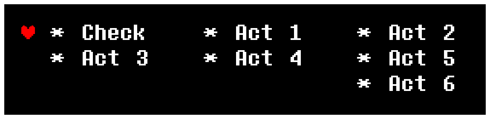

# `<CYF>` The Text object

With the Text Object, you can create text wherever you want, with or without a bubble,
with a tail or without a tail.

Plus, if you choose to make a bubble, the height of the bubble is automatically computed,
but you can still choose the bubble's height if you want to.

By default, a Text Object has a bubble with an automatically-set height, with no tail or
speech thing. Plus, the object is hidden when you enter or come out of `ENEMYDIALOGUE`. If
you want to change this, there are a lot of functions to do so.

New in v0.6.6: As this object exists in CYF's hierarchy, it's possible to manipulate its
parent. See the [General objects](general-objects.md) page for more information.

### `CreateText({table of string} / string text, {table of number, number} position, number width, string layer = "BelowPlayer", number bubbleHeight = -1)` returns **textObject** [E/M/W]

This function creates a Text Object and returns it. However, as you can see, a lot of
parameters are needed. Here is what you need to set:

- `text` - The text to display. Used the same way as in `BattleDialog`:
  `{"Text 1", "Text 2"}`. Can also just be a single line of text.
- `position` - **Two numbers**: The x and y positions of the center of the object. You'll
  be able to use `MoveTo` to adjust it afterwards. You only need two numbers, like this:
  `{320, 240}`.
- `width` - You'll always need this, as it's the maximum width of the text. The bubble's
  width will be 20px larger than the text's width. Also, bubbles have a minimum width of
  40. Example: `150`.
- `layer` - The sprite layer of the Text Object. If it doesn't exist, it returns an error.
  This argument is optional. If it's not provided, the Text Object will be in the layer
  `BelowPlayer`. Example: `"BelowPlayer"`.
- `bubbleHeight` - You can enter a static bubble height here if you want to. By default,
  this will be -1, which will auto compute the height of the bubble. However, bubbles have
  a minimum height of 40. Example: `150`.

Note: To allow for using properties such as `Text.SetFont` and `Text.color` on the same
frame as creating the text object, a one-frame delay is implemented by default: The text
object will not create its letters or start typing until one frame after you call
`CreateText`. As a consequence, expect a few properties such as `Text.color` and
`Text.GetLetters` to run into issues if you run them on the same frame you use
`CreateText`.

If you need to disable the one-frame delay, start your first line of text with the
[text command](../text-commands.md) `[instant]`. And if you need to disable *that* too,
follow it up with `[instant:stop]`.

### `Text.Remove()`

Shortcut to `Text.DestroyText`.

### `Text.DestroyText()`

This function destroys a text object, similar to `.Remove()` for bullets and sprites.

Trying to get, set or call almost anything besides `Text.isactive` on a destroyed text
object will error.

Note that this happens automatically if a text object closes itself, either by having the
player close it or by closing automatically if `progressmode` is `"auto"`.

### New in v0.6.6. **{table of string}** `Text.text`

Returns all lines of text the text object is holding. The texts might be different to how
you added them to the text object because of how CYF handles text.

For example, if your text is too long to be held within one line, the text object will
replace spaces with newline characters when needed. This change will be visible on the
current line of text and all previous ones, but not on the lines of text which have yet to
be displayed.

### **boolean** `Text.isactive`

**Read-only.** Tells you if a text object is active.

A text object will become inactive when it finishes its text and tries to continue, or if
you call `Text.DestroyText()`.

### **string** `Text.progressmode`

This value is used to set the progression mode of the text to one of the following values.

- `"auto"`: Makes the text start a new line after a given number of frames set in
  `Text.SetAutoWaitTimeBetweenTexts()`.
- `"manual"`: Makes the text require the player to press the Confirm button at the end of
  each line.
- `"none"`: With this option, you will need to manually display the next line in-code using
  `Text.NextLine()`.

### **boolean** `Text.deleteWhenFinished`

This value is used to check whether the text object should be removed or not after the text
is finished. Its default value is `true`, meaning the text object will be automatically
removed after the end of the text. You can set it to `false` to automatically hide the text
object once its text is complete, which allows you to reuse it later.

### **number** `Text.x`

The local x position of the object, measured from the position of the text object's parent.
This value depends on the object's pivot.

### **number** `Text.y`

The local y position of the object, measured from the position of the text object's parent.
This value depends on the object's pivot.

### **number** `Text.absx`

The absolute x position of the object, measured from the bottom left corner of the screen.
This value depends on the object's pivot.

### **number** `Text.absy`

The absolute y position of the object, measured from the bottom left corner of the screen.
This value depends on the object's pivot.

### New in v0.6.6. **number** `Text.textMaxWidth` or `Text.width`

Get or set the maximum width of the text. If the value is lower than 16, it'll be set back
to 16.

### **number** `Text.bubbleHeight`

Get or set the height of the bubble. If the value is lower than 40, it'll be set back to
40.

### **string** `Text.layer`

The sprite layer of the Text Object. If it doesn't exist, it returns an error. This is
`"BelowPlayer"` by default.

### **{table of number, number, number, number = 1}** `Text.color`

Get or set the color of the text, as a table of 3 or 4 values from 0 to 1. For example,
`text.color = {1.0, 0.0, 0.0}` makes the text red. Black areas are not affected by
coloration. The 4th value is the alpha (transparency) value of the text.

### **{table of number, number, number, number = 255}** `Text.color32`

Get or set the color of the text, as a table of 3 or 4 integer values from 0 to 255. For
example, `text.color = {250, 0, 0}` makes it red. Black areas are not affected by
coloration. The 4th value is the alpha (transparency) value of the text.

### `Text.ResetColor(boolean resetAlpha = false)`

Resets any previous set of the variable `Text.color` or `Text.color32`, resetting the
text's default color to the font's default color.

This function will not reset the color's `alpha` if it was set in any way unless
`resetAlpha` is set to true.

### **number** `Text.alpha`

Get or set the text's transparency, as a value between 0 and 1.

### **number** `Text.alpha32`

Get or set the text's transparency, as an integer between 0 and 255.

### `Text.ResetAlpha()`

Resets the text object's `alpha` value, whether it was set through `Text.alpha`,
`Text.color` or `Text.color32`, resetting the text's default alpha to the font's default
alpha.

### New in v0.6.6. **number** `Text.currentCharacter`

Returns a number representing the total number of characters currently shown in the text
object's text. It also works the same if your text is slowed down or sped up.

Text commands are also taken into account using this variable. You can easily check where
the text is currently at using this value and `Text.text`'s output.

### **number** `Text.currentReferenceCharacter`

Returns a number representing the total number of visible characters currently shown in the
text object's text. It also works the same if your text is slowed down or sped up.

Any text commands that you have in your active line of text will be ignored by this number,
as it only counts the visible characters, and not the length of the string you put into the
text object.

### New in v0.6.6. **number** `Text.rotation`

Gets or sets a text object's rotation, in degrees. Will also rotate the text object's
bubble if it has any.

The text object will rotate around the bottom left corner of the first letter of the text
object.

It's clamped between 0 and 360, so if you set it to 365, it will become 5.

### New in v0.6.6. **number** `Text.adjustTextDisplay`

False by default. If set to true, CYF will try to adjust the text's position and scale to
prevent jagged lines appearing if the text's scale or position is slightly off.

Only taken into account if set, otherwise the global value set through the
`adjusttextdisplay` Encounter variable is used.

### **number** `Text.currentLine`

Returns the number of the line (page) that the text is currently on, starting from 0.

So, if your text object's text table is `{"Text 1", "Text 2"}`, then `"Text 1"` is line 0,
and `"Text 2"` is line 1.

### New in v0.6.6. **string** `Text.linePrefix`

This variable will be added at the beginning of each line of text the text object will
display.

Useful for adding various text commands you want to apply to all lines of text displayed by
a given text object.

### New in v0.6.6. **number** `Text.columnNumber`

Represents the number of columns used by some texts in CYF, such as the ITEM and ACT menu.
If this value is set, you should also consider changing `Text.columnShift`.

This value is only ever used by the engine, so setting it to a specific value doesn't
prevent you from using the character `\t` as much as you like. Refer to the entry on
`Text.columnShift` for more information on the character `\t`.

### New in v0.6.6. **number** `Text.columnShift`

Amount of horizontal pixels the letters move by from their last column, or first character,
whenever the character `\t` is used.

The `\t` character is used in-engine for aligning columns of text. It affects the current
line of the text and can be used several times on the same line to support more than two
columns.

For example, the following text will result in the following image:

```lua
* Check \t * Act 1 \t * Act 2 \n
* Act 3 \t * Act 4 \t * Act 5 \n
\t \t * Act 6
```



### **{table of sprite}** `Text.GetLetters()`

Returns a table containing sprite objects representing every letter to be displayed in the
text object's current line of text. Note that even if a text object has not finished typing
yet, all characters it will type are still accessible this way.

Letter sprite objects can not have their layer changed, can not run `sprite.Mask`, and can
only be parented to other letter sprites. They cannot be deleted or dusted using
`sprite.Dust()` as well.

Note: Accessing this table generates the table anew every time. To save on resources, store
this table to a local variable before doing any operations on it. Even code such as
`for i = 1, #text.GetLetters() do` is a bad idea.

It is recommended to use this property in coordination with the
[Game event](../game-events.md) `OnTextAdvance`. You may also not be able to use this on
the same frame as creating the text, read the note under `CreateText` for more information.

Here is an example of using `Text.GetLetters` to apply offset and rotation to every letter.

```lua
local t = CreateText({"Some example text for testing!"}, {40, 400}, 560, "Top")
t.HideBubble()
t.progressmode = "none"

function OnTextAdvance(text, final)
    if text == t and final == false then -- optional if you only have one text object
        local letters = t.GetLetters()

        for i = 1, #letters do
            letters[i].y = math.sin(i) * 3
            letters[i].rotation = math.sin(i * 1.5) * 6
        end
    end
end
```

Alternatively, if you want it all done on the first frame, it's much more compact:

```lua
local t = CreateText({"[instant]Some example text for testing!"}, {40, 400}, 560, "Top")
t.HideBubble()
t.progressmode = "none"

local letters = t.GetLetters()

for i = 1, #letters do
    letters[i].y = math.sin(i) * 3
    letters[i].rotation = math.sin(i * 1.5) * 6
end
```

### **function** `Text.OnTextDisplay(text text)`

Every time this text object's letters are created, this function gets called. This function
is the best place to manipulate the text object's letters using `Text.GetLetters`.

The argument `text` is the text object itself.

If this value isn't set and the function `OnTextDisplay()` exists in the Encounter script,
it will call it with the text object as its argument.

### `Text.SkipLine()`

This function skips to the end of the text object's current text, as if using the text
command `[instant]`.

If `playerskipdocommand` is true, this function will behave the same as a player skip. See
[Special variables](../../basics/special-variables.md) for an explanation on
`playerskipdocommand`.

### **boolean** `Text.lineComplete`

**Read-only.** Returns true if the current line (page) of text is fully displayed, false
otherwise.

### **boolean** `Text.allLinesComplete`

**Read-only.** Returns true if the current line of text is fully displayed *and* if this is
the last line the text object will show, false otherwise.

### **number** `Text.lineCount()`

This function returns the total number of lines or pages of text set to the text object,
regardless of whether they've been shown yet.

### `Text.NextLine()`

Shows the next line (dialogue) of the text instantly, regardless of if the current one is
finished or what progress mode the object has.

If you run this function while this is this text object's last line, it will delete the
text object if its `Text.deleteWhenFinished` variable is set to true, otherwise it will
deactivate it until further use.

### `Text.SetWaitTime(number time)`

Shortcut to `Text.SetAutoWaitTimeBetweenTexts`.

### `Text.SetAutoWaitTimeBetweenTexts(number time)`

Sets the number of frames to wait before automatically going to the next line of text.
*Only applies to the "auto" progress mode.*

### `Text.SetAnchor(number x, number y)`

If this text object has a parent set via `Text.SetParent`, this will control its anchor
point, the relative point on the parent sprite that the text object will follow if the
parent sprite gets scaled.

`x` and `y` should usually both be between `0` and `1`. However, you are free to use
numbers outside of this range as well.

Works exactly the same as `sprite.SetAnchor` (see
[Sprites and animation](../sprites-and-animation.md)).

### **number** `Text.xscale`, **number** `Text.yscale`

Allows you to stretch and squish text objects, similarly to sprite objects.

This works at any point: while the text has not yet started to type, is in the middle of
typing, is paused, between lines, even if it's done typing.

### `Text.Scale(number xscale, number yscale)`

Same as setting `Text.xscale` and `Text.yscale` at the same time.

### `Text.MoveBelow(text otherTextObject)`

Moves a text object below another text object. They must both be on the same layer.

### `Text.MoveAbove(text otherTextObject)`

Moves a text object above another text object. They must both be on the same layer.

### `Text.SendToTop()`

Sends this text object to the top of its layer's hierarchy. If a sprite has 5 children, for
instance, you can use this to rearrange this text object's position internally. However,
child text objects will always appear on top of their parents, regardless of this function
being called.

### `Text.SendToBottom()`

Sends this text object to the bottom of its layer's hierarchy. Similar rules apply as with
`SendToTop()`.

### `Text.AddText({table of string} text (OR) string text)`

Adds the given text to the object's text table. Acts like `Text.SetText()` if all the text
is already done.

### `Text.SetText({table of string} text (OR) string text)`

Sets the text in the Text Object. If the text object is inactive when this is called, the
object will reactivate itself.

### `Text.SetPause(boolean pause)`

Pauses the text object's typing, in the same way as `[waitfor:key]`, except that it doesn't
resume until you use this function again.

However, while paused, text can still be skipped, unless `[noskip]` is applied to the text
first.

### **boolean** `Text.isPaused()`

This function will return a boolean, telling you whether text has been paused with
`SetPaused`. It does not count if the text object was paused by other means, such as
`[waitfor:key]`.

### `Text.SetVoice(string voiceName)`

Sets the voice of the text object. It's the same as the text command `[voice]`.

### `Text.SetFont(string fontName)`

Sets the font of the text. It's the same as the text command `[font]`. Returns an error if
the font doesn't exist.

### `Text.SetEffect(string effect, number intensity = -1)`

Sets the effect of the text. Can be easily replaced with the text command `[effect]`. Can
only take `none`, `twitch`, `shake` or `rotate` as the effect.

If you want to use the default intensity value, enter `-1`.

### `Text.ShowBubble(string side = nil, number/string position = nil)`

Use this function to add a bubble to the text. You can also set the side and the position
of the tail, also known as speech thing, if you want to. Look at
`Text.SetSpeechThingPositionAndSide` to see how to use this.

### `Text.SetTail(string side, number/string position = "50%")`

Shorter alias of `Text.SetSpeechThingPositionAndSide`.

### `Text.SetSpeechThingPositionAndSide(string side, number/string position = "50%")`

Sets the size and position of the dialogue bubble's tail, also known as speech thing. The
`side` can only take `"left"`, `"right"`, `"up"`, `"down"` or `"none"`.

`"none"` is used to hide the speech thing, while the other directions control the side of
the bubble where the speech thing is.

`position` can be set to one of two things:

- A number. If the `side` is `"left"` or `"right"`, this will determine its distance from
  the bottom of the bubble. If the `side` is `"up"` or `"down"`, then this will determine
  its distance from the right side of the bubble.

  If on the bottom or top of the bubble, this value can only be between 0 and the bubble's
  width. If on the left or right sides of the bubble, this value can only be between 0 and
  the bubble's height.
- A string. It must be formatted like `"0%"`, where you can replace the "0" with any
  percentage. If on the top or bottom of the bubble, `"0%"` will be the right side of the
  bubble and `"100%"` will be the left side of the bubble. If on the left or right side,
  `"0%"` will be the bottom of the bubble and `"100%"` will be the top of the bubble. The
  value can only be between "0%" and "100%".

### `Text.HideBubble()`

A function that hides the bubble.

### New in v0.6.6. `Text.Move(number x, number y)`

Moves the text object by x pixels horizontally and y pixels vertically from its current
position.

### `Text.MoveTo(number x, number y)`

Moves the text to a new position, relative to the text object's parent's position.

### `Text.MoveToAbs(number x, number y)`

Moves the text to a new position, relative to the bottom left corner of the window.

### New in v0.6.6. **number** `Text.GetTextWidth(number firstLetter = 0, number lastLetter = 999999)`

Returns the width of the currently set text in pixels. Useful if you want to center your
text. Will give the same result even if the text isn't finished typing.

Also ignores `Text.xscale`.

`firstLetter` chooses the index of the first letter from which the text's width should be
computed, while `lastLetter` chooses the index of the last letter, and both start with `0`
as the index for the first letter.

The values of these arguments can be negative, in which case it will start from the end,
pointing at the xth last letter of the text. For example, using `Text.GetTextWidth(-4)` on
the text `I want some text` will start counting the text's width from the first t of
"text", or the 4th letter from the end of the text.

### New in v0.6.6. **number** `Text.GetTextHeight(number firstLetter = 0, number lastLetter = 999999)`

Returns the height of the currently set text in pixels. Will give the same result even if
the text isn't finished typing.

Also ignores `Text.yscale`.

`firstLetter` chooses the index of the first letter from which the text's height should be
computed, while `lastLetter` chooses the index of the last letter, and both start with `0`
as the index for the first letter.

The values of these arguments can be negative, in which case it will start from the end,
pointing at the xth last letter of the text. For example, using `Text.GetTextHeight(-4)` on
the text `I want some text` will start counting the text's height from the first t of
"text", or the 4th letter from the end of the text.

### `Text.SetVar(string yourVariableName, value)` or `Text[string yourVariableName] = value`

Sets a variable in a text object that you can retrieve with `Text.GetVar`. Identical to
`SetVar` in projectiles.

### `Text.GetVar(string yourVariableName)` or `Text[string yourVariableName]`

Gets a variable in a text object that you previously set with `Text.SetVar`. Identical to
`GetVar` in projectiles.
