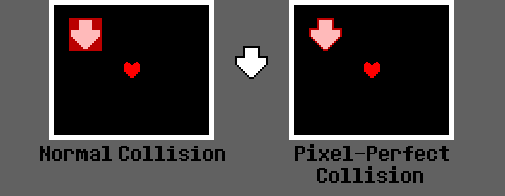

# The Pixel-Perfect Collision System

Instead of the engine's default rectangular collisions and having to use thousands of lines of
`if` statements in `OnHit` just to get precise collisions, you can use the Pixel-Perfect
Collision System.

You can use this system for your entire encounter with `SetPPCollision(bool)`, or you can
apply it just to a bullet with `bullet.ppcollision`. The bullet's `ppcollision` value will
override the encounter's `ppcollision` value.

The Pixel-Perfect Collision System supports bullets with scale. You can rotate and move
bullets like always and collision will still work.

One last tip: The Pixel-Perfect Collision System is more resource-intensive than the Normal
Collision System. Don't use Pixel-Perfect for bullets that won't damage you, as that will
just waste resources.

Note: PPCollision does **NOT** affect the hitboxes shown when pressing `H` with the
debugger open.

### `SetPPCollision(boolean bool)` [E/M/W]

Call this to set the encounter's **default** collision system.

Enter `false` for the regular rectangular system, or `true` for PPCollision.

Calling this will force all bullets with `Bullet.ppchanged` as `false` to use the collision
system you enter here (see below). `Bullet.ppchanged` will remain `false`.

The initial value is `false`.

## From [Projectile management](projectiles.md)

### **boolean** `Bullet.ppcollision`

If this is true, the bullet will use the Pixel-Perfect Collision system.

By default, this is the encounter's **default** collision system.

Manually setting this will set `Bullet.ppchanged` to true.

### **boolean** `Bullet.ppchanged` (read-only)

Tells you if the bullet's collision system has been changed by manually changing
`Bullet.ppcollision`.

Bullets with `Bullet.ppchanged` set to true will NOT be affected by future calls of
`SetPPCollision`.

Will be false after you call `Bullet.ResetCollisionSystem()`, or if you haven't changed
`Bullet.ppcollision`.

### `Bullet.ResetCollisionSystem()`

Resets the collision system of the bullet to the encounter's **default** collision system.

The default collision system is set by `SetPPCollision`.
