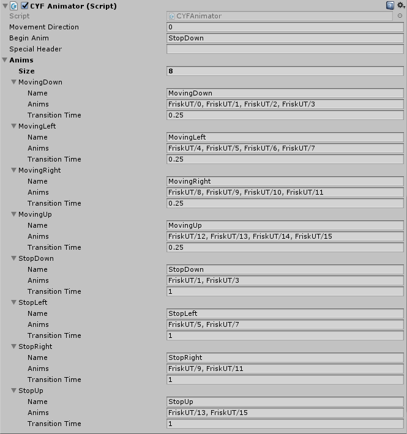

# `<CYF>` How to add an animation to an event

Tired of all these static events? Do you want them to be animated, to bring more life to
your map? You're in the right place.

Animating events is (again) something very easy, but it may be time-consuming. This animator
is used like `sprite.SetAnimation()`, only the ways you fill in data are different.

- All the animations are driven by a component named `CYFAnimator`. Click on the event you
  want to add this component in, go to the very bottom of the Inspector tab, then click on
  the button "Add component".
- Enter "CYFAnimator" and you should be able to find it. Click and it'll be added.

This is a working example of the `CYFAnimator` object. The 8 animations pictured here are
the minimum ones required to make the component run correctly.

You should be able to see some variables. Here is a description of each of them:

- `Movement Direction`: The direction that the event goes. Normally, you don't need to
  modify this, as the component will calculate this by itself.
- `Begin Anim`: The name of the animation that the event will start with.
- `Special Header`: This variable is used to modify the event's animation scheme.

  Normally, the event will start the animations `StopDown`, `StopUp`, `MovingDown`,
  `MovingUp` and all the others in the screenshot. But if you set this variable, it'll act
  as a prefix for the animations.

  So, if this variable is set to "Frisk", the `CYFAnimator` component will use
  `FriskMovingDown`, `FriskMovingUp`, and so on instead of the others.

  There is one exception to this scheme. If the special header is equal to an animation's
  name, said animation will be the only one used while the special header has this value.
- `Anims`: Your list of animations. Check the screenshot above to see how you should fill
  it.

  **Note:** While any mix of the above animations is fine, such as only having vertical
  animations if your event will only move up and down, an animation named "StopDown" is
  **required** for every event with a CYFAnimator component. It is the default animation,
  and the absolute bare minimum to include if you wish to have a CYFAnimator component.

And that's it for animated events. The biggest part here is to fill in the Anims list.
