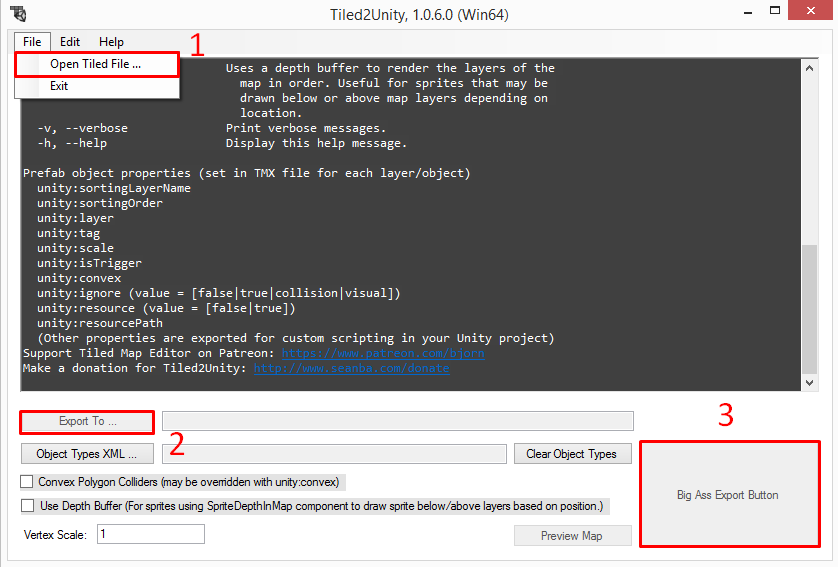

# `<CYF>` How to create a map in Unity with Tiled2Unity

Creating a map for CYF is not that difficult. All that you need to do is follow the rules.
There are a lot of them, but as long as you stick to them, you'll be fine.

Note for this repository: the original tutorial tells you to copy the contents of the demo
scene `Assets/Scenes/test4.unity`. That scene, along with every other demo overworld map,
was removed in v0.0. Until this project has an overworld scene of its own to copy from, you
will need to assemble the scene contents by hand from the prefabs named below, chiefly
`Main Camera OW` and `Canvas OW` in `Assets/Resources/Prefabs`.

The very first step is to create the map in Tiled, and save it.

Tip: Undertale's tiles are 20x20 pixels, with a scale factor of 2. Make a tileset of 40x40px
tiles so you will not have to worry about scaling.

## Exporting from Tiled2Unity

- Open Tiled2Unity.exe
- `File` -> Choose your .tmx file
- `Export To` -> `PathToCYF\Assets\Tiled2Unity\Tiled2Unity.export.txt`
- Click the `Big Ass Export Button`
- Close Tiled2Unity and open Unity

## Setting up the scene

- Now that you're in Unity, you should create a scene, then delete the Main Camera object,
  save and then name the map. The name will be important.
- Open an existing overworld scene, copy all its contents and paste them into your newly
  created scene.
- In the `Project` tab, go to `Assets\Tiled2Unity\Prefabs` and you should see your map. Drag
  and drop it over the scene. Put it in the root, not in a directory.
- Go to `Assets\Resources\Prefabs` and include `Main Camera OW` like you did in the previous
  line. Now you should be able to see something in the Game tab.

## Arranging the map

- Remove the map in `Background`, disable the objects `Foreground` and `Bottom` by clicking
  on each object, going to the Inspector and unchecking the box right next to the object's
  name.
- Move your map so that the bottom-left corners of the map and the camera are at the same
  coordinates.
- Delete everything that is in the GameObject `Background`, except for the TPs. You'll see
  that your map object is composed of every layer that you've added in your map.
- Now, inside of `Background`, you'll have to insert the main object component of your map
  and its colliders, in your object layers. If Unity asks you if you want to break the
  prefab, say "Yes".
- If there are other layers, just put them in the root.
- Delete the object which contained all the map elements.

## Sizing the background

Adjust so that `Background`'s RectTransform fits in the map. It's very important, as the
RectTransform bounds are used for map scrolling.

Tips:

- Put all of `Background`'s children in the root or as the children of another object, so
  that their position isn't changed while the background moves.
- Then, `Background`'s RectTransform size will be equal to (the bounds of the map / 100), so
  if your map is 640x480, the size will be 6.4 by 4.8.
- Now, center the main map object to make it fit inside of `Background`'s `RectTransform`.
- Don't forget that `Background`'s `RectTransform`'s bottom-left corner must be at the same
  coordinates as the `Main Camera OW`'s `RectTransform`'s bottom-left corner.
- Now, when everything is all done, put `Background`'s old children back to their original
  places as `Background`'s children.

Note: The absolute minimum size for a map for the camera to function properly is 640x480.

## Layering

- For each map component, go to the component `Sorting Layer Exposed` and set the value
  `Order in Layer` to 0.
- For each map component, you'll need to set the Z value of the map. The Z value works like
  this: the greater it is, the further into the background a component will be.

  Set `Background`'s Z value to 140, then play around this value to set the Z value of other
  background layers (between 139 and 141; you can use decimal numbers, of course).

  For foreground layers' Z values, you should use values between -1.5 and -0.5.

  Warning: The maps' Z value must be set to 0 after setting the layers' Z values.

## Teleports

Edit, add and/or remove the TP objects. You'll have to set some values for the TP: see the
component `TP Handler`.

- `Scene Name` = Name of the destination scene of the TP.
- `Position` = Position of the player in the destination map, from the bottom-left corner of
  the map.
- `Direction` = Direction the player will be facing after the TP. `2` = Down, `4` = Left,
  `6` = Right, `8` = Up. These follow the NumPad layout.
- `Activated` = Boolean used when the TP is activated. Don't activate it manually.

## Colliders and map info

- Change the layer of all of the colliders. Give them the layer `BlockingLayer`.

  Tip: Select the first one, then shift-click on the last one. Then, you can change the
  layer of all objects simultaneously.
- Finally, modify the data in the object `Background`, in the `Map Info` Component.
  - `Music` = Name of the BGM played on the map. The BGM must be in the `Audio` folder of
    the mod or the `Default` folder.
  - `Mod To Load` = Name of the mod loaded by the map.
  - `Is Music Kept Between Battles` = Makes the Overworld music keep playing during battles,
    like the CORE in Undertale. If unsure, leave unchecked.
  - `No Random Encounter` = Check to disable random encounters on your map. If left
    unchecked, random encounters will occur, by randomly choosing an encounter .lua file
    from the mod set in `Mod To Load`. Will exclude any encounters whose names start with
    `#`.
- When everything is ready, remove the `Main Camera OW` object and save the map.

## Now, it's time to test it

Your map is now ready, but it isn't playable yet. Before testing it, we'll need to add it to
the Build.

When you're on your newly created map, open `File` -> `Build Settings...`. Click on the
button `Add Open Scenes` while you're on your map. It should now be in the list of Scenes in
the Build. It'll be built with the project and it can now be used.

- Open the scene `Assets\Scenes\TransitionOverworld.unity` and search for the GameObject
  `Main Camera OW`.
- Go to the component `Transition Overworld` and change the values.
  - `First Level To Load`: Name of the first scene to load.
  - `Beginning Position` = Position of the player in the first map, from the bottom-left
    corner of the map.
- Load the scene `Disclaimer.unity` and launch the game. Start a new game if you've already
  saved.

You should now be in your map.

Run some tests on the map if there are problems. If there are no problems, you can now move
on to adding events.
