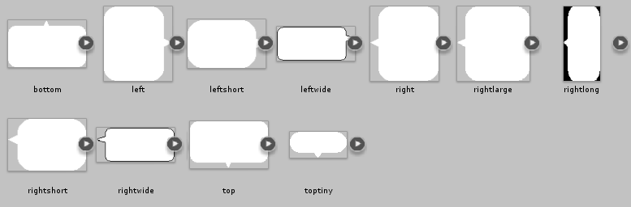

# Dialog bubble names

This is the list of every dialogue bubble name you can use with `dialogbubble` in your
monster scripts, and what each one looks like.

Set it in a monster script like this:

```lua
dialogbubble = "rightshort"
```

Positioning of the bubbles is done automatically. See
[Special variables](../basics/special-variables.md) for the `dialogbubble` entry, including
how to leave it `nil` to get an automatically sized bubble instead.


