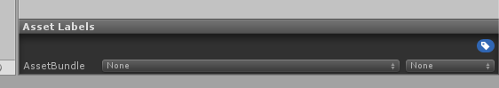
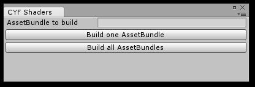

# Shaders - Introduction

As of Create Your Frisk v0.6.5, you may now use Unity shaders in your encounters.

Be warned that **this is a very advanced feature** and not everyone will be able to create
their own shaders. However, any shaders people make and release can be added into a mod
very easily. This page is intended to serve as a basic outline and interface into how the
system works.

## Basic overview

Here's how shaders are set up in CYF:

- First of all: Shaders are stored as
  [Unity AssetBundles](https://docs.unity3d.com/2018.4/Documentation/Manual/AssetBundlesIntro.html).
  You might expect them to be `.shader` files, but they **aren't**. Keep that in mind.
- Every bundle can contain multiple shaders. When loading a shader in your mod, you will
  have to provide the name of a bundle, as well as the name of a shader in the bundle.
- The actual file setup consists of a folder (the bundle) within the `Shaders` folder, with
  files inside named `windows`, `mac`, and `linux`. **Keep all of these files** if you want
  your mod to be cross-compatible between operating systems.
- These files are created by Unity, so if you want to create your own shaders, **you MUST
  set up Unity** on your machine. Read [Unity setup](../basics/unity-setup.md) for a guide.
- There are some default shaders included with CYF, present in the `CYF/Default/Shaders`
  folder. They are treated just like sprites and audio, in that shaders will be read from
  the mod's `Shaders` folder first, and the Default shaders folder second.

And on the topic of creating shaders:

- All shaders are coded using Unity ShaderLabs. See [Coding a shader](coding-a-shader.md)
  for links and help. They will be created as `.shader` files on the Unity side before
  they're exported to bundles. Note that the majority of the work and involvement in
  creating a shader is knowing how to write the shader, and has nothing to do with CYF.
- Not all errors and issues with shaders will explicitly show an error screen in game,
  instead resulting in a pink "error" shader being applied. When creating your shader in
  Unity, you will be able to see syntax errors and such before compiling your shader.
- If the shader, and all of its fallbacks, are found to be unsupported, you'll see an error
  screen when loading the shader. You will need to use the Lua function `pcall` to account
  for this. An example is provided in [The Shader object](shader-object.md).
- While actually creating a shader in Unity, there's a shortcut function available
  (`shader.Test`) that does not require you to build your shaders to AssetBundles
  repeatedly.
- Depending on the setup of the shader, it may or may not cause issues with Create Your
  Frisk features such as sprite layers and sprite masking. This is why it is recommended
  that all shaders used be based off of the template located at
  [Coding a shader](coding-a-shader.md) and
  `Assets/Editor/Shaders/CYFShaderTemplate.shader`.

## Creating shaders

The first step involved with creating shaders is to set up Create Your Frisk in Unity on
your machine. Read through [Unity setup](../basics/unity-setup.md) for a guide on doing
this.

After that, locate the path `Assets/Editor/Shaders`. This is where you will create and edit
your shaders as `.shader` files. You can also find here all of the default shaders Create
Your Frisk comes with, which are in `Default/Shaders` when Create Your Frisk gets built.

Create a new `.shader` file here, with whatever name you like. This name is the name you
will eventually pass to `shader.Set` from the Lua side. Follow the instructions in
[Coding a shader](coding-a-shader.md) to write the contents of your shader file. You may
use `shader.Test` from mods within the Unity editor, found at `Assets/Mods`, to test
shaders before you compile them.

Once you're done editing and testing your shader, it's time to compile it to an
AssetBundle. Using the Unity project files viewer, normally at the bottom of the screen,
browse to the path `Assets/Editor/Shaders`. Click on your shader. Look for the "Asset
Windows" label, normally at the bottom-right of the screen, under the Inspector.

Click on the button to the right of "AssetBundle" (says "none" in this image), and enter the
name of a bundle. This will be the name of the folder that gets exported, that you will be
able to drop in your mod's `Shaders` folder later. You can have multiple shaders contained
in one bundle, and as many bundles as you like. As an example, all of the shaders listed
below are part of the `cyfshaders` bundle.

Finally, to compile all shaders into AssetBundles, click on `Create Your Frisk` at the top
of the Unity window, and click on `Build Shader AssetBundles...` in the list. A new window
will appear.

You may either click `Build all AssetBundles` to build every AssetBundle you defined
earlier, or you may enter a single name in the box and click `Build one AssetBundle` to
only build one AssetBundle of your choosing, for instance `cyfshaders`.

You will have to wait for a moment while the shaders get built into bundles. You will see an
alert box whenever the shaders are done being bundled. Once finished, your bundles will
appear in `Assets/Editor/Output`. They will be present as folders, with the same names as
the AssetBundles you set up in the editor. Each one of these folders is a shader bundle
that you may now move to your mod's `Shaders` folder.

## Sample shaders

Create Your Frisk v0.6.5 comes with an AssetBundle named `"cyfshaders"`, containing several
sample shaders for you to toy with, be it on the Lua side or as a means to create your own
shaders.

Remember that you can find the source code for these shaders in the repository, under
`Assets/Editor/Shaders`. You may set all of the properties listed in the "usage" column by
using the functions within [The Shader object](shader-object.md) on the Lua side. All the
keywords are disabled by default, that's just how the shader language functions.

| Shader name | Description | Usage |
| --- | --- | --- |
| CYFShaderTemplate (not in the bundle) | A template base shader to build all your own shaders from. Same as the sample shader in [Coding a shader](coding-a-shader.md). | No unique properties or variables. |
| Displacement | A shader that allows for the use of displacement maps, by means of images in your mod's Sprites folder. Colors greater than 50% will move the rendered space forward, while colors less than 50% will move it backwards. For reference, the color `#808080` represents zero displacement. | `DispMap` - Texture - The displacement map in question. `Intensity` - Float - Controls the magnitude of the displacement. 1 by default. `NO_PIXEL_SNAP` - Keyword - If enabled, disables pixel snapping on the newly rendered image (blurry). `NO_WRAP` - Keyword - If enabled, does not render pixels that were outside of the original image or screen boundaries. |
| FitScreen | This shader is intended for use alongside `Misc.SetWideFullscreen(true)`, and should be applied to the camera through `Misc.ScreenShader`. It forcefully takes the 640x480, 4:3 normal display area of CYF and stretches it across the user's monitor, when in fullscreen. In other words, it uses a "stretch" display method instead of keeping letterboxing, even if it is controllable. | `Width` - Float - Controls the new size of the display area. Should be set to `640` normally, or `math.ceil(math.max(Misc.MonitorWidth / 3, 640))` in fullscreen. `NO_PIXEL_SNAP` - Keyword - If enabled, disables pixel snapping on the newly sized screen render (blurry). |
| Gradient | A simple shader that takes 4 colors (all white by default), applies them to the 4 corners of an image or the screen, and generates a color gradient connecting them. The colorization is done similarly to `sprite.color`, so the effect may be most visible with white images. | `TopLeft` - Color - Color for the top left corner. `TopRight` - Color - Color for the top right corner. `BottomLeft` - Color - Color for the bottom left corner. `BottomRight` - Color - Color for the bottom right corner. |
| Invert | A simple shader that inverts the colors of every displayed pixel. | No unique properties or variables. |
| Rotation | This shader is intended to be applied to the camera through `Misc.ScreenShader`. The purpose of this shader is to allow the entire screen to be rotated all around. It has customizable pivot points, as well. | `Rotation` - Float - Rotation of the screen. 0 by default. This value takes degrees. `xPivot` - Float - X pivot to rotate around. 0.5 (center) by default. `yPivot` - Float - Y pivot to rotate around. 0.5 (center) by default. `WRAP` - Keyword - If enabled, renders pixels that were outside of the original screen boundaries. `NO_PIXEL_SNAP` - Keyword - If enabled, disables pixel snapping on the newly rendered image (blurry). |
| ScreenScale | This shader is intended to be applied to the camera through `Misc.ScreenShader`. This shader scales the screen horizontally and vertically, similarly to `sprite.Scale`. Values can be both positive and negative, which can also result in flipping the screen. | `HorMult` - Float - Horizontal Scale. 1 by default. `VerMult` - Float - Vertical Scale. 1 by default. `WRAP` - Keyword - If enabled, renders pixels that were outside of the original screen boundaries. `NO_PIXEL_SNAP` - Keyword - If enabled, disables pixel snapping on the newly sized screen render (blurry). |
| Wave | A nifty effect that makes an image appear to wave and sway back and forth. Its size and distance can be customized. | `Width` - Float - Controls the width of the wave motion. Larger numbers mean more distance travelled horizontally. 1 by default. `Rate` - Float - Controls the rate of waves in the image. Larger numbers mean less space between waves. 1 by default. `NO_WRAP` - Keyword - If enabled, does not render pixels that were outside of the original image boundaries. `NO_PIXEL_SNAP` - Keyword - If enabled, disables pixel snapping on the newly rendered image (blurry). |
